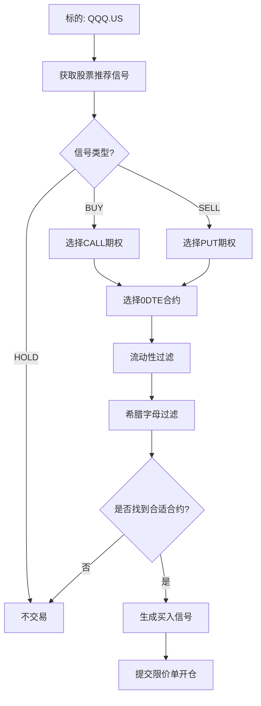

# 策略10期权日内交易逻辑分析与收益评估报告

**日期**: 2026-01-29
**策略名称**: 5000刀期权（策略ID: 10）
**策略类型**: OPTION_INTRADAY_V1
**标的资产**: QQQ.US
**资金分配**: 资本分配ID 9

---

## 📋 执行摘要

**策略概述**: 基于股票推荐引擎的0DTE期权日内交易策略，通过跟随技术信号做多看涨/看跌期权，当日收盘前强制平仓。

**关键特点**:
- ✅ 日内交易（0DTE - Zero Days To Expiration）
- ✅ 跟随技术信号（BUY→CALL, SELL→PUT）
- ✅ 严格的流动性和希腊字母过滤
- ✅ 收盘前30分钟强制清仓
- ⚠️ 仅做多（long-only），无做空

---

## 🔍 完整交易逻辑分析

### 1. 信号生成流程



### 2. 策略配置详解

#### 2.1 基础配置

```json
{
  "assetClass": "OPTION",
  "expirationMode": "0DTE",
  "directionMode": "FOLLOW_SIGNAL",
  "entryPriceMode": "ASK"
}
```

**说明**:
- **0DTE**: 当日到期期权，时间价值衰减快，风险高但成本低
- **FOLLOW_SIGNAL**: 跟随股票推荐信号决定方向
  - 推荐BUY（看涨） → 买CALL
  - 推荐SELL（看跌） → 买PUT
- **ASK价开仓**: 使用卖一价作为限价单价格（确保成交但略贵）

#### 2.2 持仓规模配置

```json
{
  "positionSizing": {
    "mode": "MAX_PREMIUM",
    "fixedContracts": 1
  }
}
```

**说明**:
- **MAX_PREMIUM模式**: 根据资金上限计算最大可买合约数
- 如果资金分配允许，可买多张合约
- **默认1张**: 如果未设置预算或模式错误，默认买1张

#### 2.3 流动性过滤器

```json
{
  "liquidityFilters": {
    "minOpenInterest": 500,
    "maxBidAskSpreadAbs": 0.3,
    "maxBidAskSpreadPct": 25
  }
}
```

**目的**: 确保期权合约有足够流动性，避免滑点和难以平仓

**标准**:
- ✅ 持仓量 ≥ 500张（活跃合约）
- ✅ 买卖价差 ≤ $0.30（绝对值）
- ✅ 买卖价差 ≤ 25%（相对值）

**影响**: 这些过滤器可能会过滤掉很多合约，降低交易机会

#### 2.4 希腊字母过滤器

```json
{
  "greekFilters": {
    "deltaMin": 0.25,
    "deltaMax": 0.6
  }
}
```

**目的**: 选择中等实值程度的期权

**Delta解读**:
- **Delta 0.25-0.6**: 虚值到轻度实值期权
  - Delta 0.25: 约25%概率到期实值（虚值期权，便宜但风险高）
  - Delta 0.6: 约60%概率到期实值（接近平值，价格合理）
- **排除深度实值**（Delta > 0.6）: 太贵，杠杆低
- **排除深度虚值**（Delta < 0.25）: 太便宜，但归零概率高

**策略意图**: 平衡成本和成功概率，选择有杠杆但不极端的合约

#### 2.5 交易时间窗口

```json
{
  "tradeWindow": {
    "noNewEntryBeforeCloseMinutes": 60,
    "forceCloseBeforeCloseMinutes": 30
  }
}
```

**时间规则**:
- ⏰ **收盘前60分钟**: 不再开新仓（避免时间不足）
- ⏰ **收盘前30分钟**: 强制平仓所有持仓（市价单清仓）

**风险控制**: 0DTE期权在收盘时归零，必须提前平仓避免全损

#### 2.6 手续费模型

```json
{
  "feeModel": {
    "commissionPerContract": 0.1,
    "minCommissionPerOrder": 0.99,
    "platformFeePerContract": 0.3
  }
}
```

**费用结构**:
- **佣金**: 每张合约 $0.10（最低 $0.99/单）
- **平台费**: 每张合约 $0.30
- **总手续费**: 约 $0.40/张 + 最低 $0.99

**示例计算**（买1张合约）:
```
权利金: $1.50 × 100 = $150
佣金: max($0.10 × 1, $0.99) = $0.99
平台费: $0.30 × 1 = $0.30
总成本: $150 + $0.99 + $0.30 = $151.29
```

**平仓再收一次**: 买入+卖出 = 双向手续费

**盈亏平衡点**: 权利金需上涨约 $0.03/张（3美分）才能抵消手续费

---

## 📊 交易执行流程

### 开仓流程（买入期权）

1. **信号触发**
   - 每个交易周期检查QQQ.US的推荐信号
   - 如果推荐BUY/SELL且不是HOLD → 生成期权信号

2. **合约选择**
   ```
   标的: QQQ.US
   → 查询富途API获取期权链
   → 筛选0DTE合约
   → 应用流动性过滤（持仓量 ≥500, 价差 ≤$0.30）
   → 应用希腊字母过滤（Delta 0.25-0.6）
   → 选择最佳合约（通常选ATM或轻度OTM）
   ```

3. **价格确定**
   - 使用ASK价（卖一价）作为限价单价格
   - 确保快速成交，但代价是略贵于中间价

4. **订单提交**
   ```json
   {
     "symbol": "QQQ260130C625000.US",
     "side": "Buy",
     "order_type": "LO",
     "submitted_quantity": "1",
     "submitted_price": "1.50",
     "outside_rth": "RTH_ONLY",
     "time_in_force": "Day"
   }
   ```

5. **资金分配**
   - 从资本分配ID 9中扣除总成本（权利金 + 手续费）
   - 记录持仓和分配金额

### 平仓流程（卖出期权）

#### 正常平仓（收盘前30分钟）

1. **时间检查**
   - 策略调度器每5分钟检查一次
   - 检测到"距离收盘 ≤ 30分钟" → 触发强制平仓

2. **平仓订单**
   ```json
   {
     "symbol": "QQQ260130C625000.US",
     "side": "Sell",
     "order_type": "MO",  // 市价单！
     "submitted_quantity": "1",
     "outside_rth": "RTH_ONLY",
     "time_in_force": "Day"
   }
   ```

3. **使用市价单的原因**
   - ⏰ 时间紧迫，必须确保成交
   - 📉 0DTE期权接近到期，价值快速衰减
   - 🎯 避免限价单不成交导致期权归零

4. **资金结算**
   - 收回权利金（可能盈利或亏损）
   - 扣除平仓手续费
   - 释放资本分配

#### 异常平仓（止损/止盈）

目前策略**没有设置止损或止盈**，只有强制收盘前平仓。

**潜在风险**:
- ⚠️ 如果日内大幅亏损（如权利金归零），仍会持有到收盘前
- ⚠️ 如果日内大幅盈利（如翻倍），也会持有到收盘前
- ⚠️ 无法提前锁定利润或止损

---

## 💰 收益率与胜率评估

### 理论收益分析

#### 情景1: 方向正确（看对了）

假设买入CALL，QQQ当日上涨：

```
开仓:
  买入 QQQ260130C625000 @ $1.50
  总成本: $151.29（含手续费）

标的上涨2%:
  期权价格可能涨到 $2.50-$3.00（因Delta 0.25-0.6）
  假设涨到 $2.50

平仓:
  卖出 @ $2.50 → 收回 $250
  手续费: $1.29
  净收益: $250 - $151.29 - $1.29 = $97.42

收益率: $97.42 / $151.29 = 64.4%
```

**关键因素**:
- 📈 标的涨幅越大，期权涨幅越大（杠杆效应）
- ⏰ 0DTE期权Gamma高，价格波动剧烈
- 🎯 Delta决定期权对标的价格变化的敏感度

#### 情景2: 方向错误（看错了）

假设买入CALL，QQQ当日下跌或横盘：

```
开仓:
  买入 QQQ260130C625000 @ $1.50
  总成本: $151.29

标的下跌1%或横盘:
  期权价格可能跌到 $0.50-$0.80
  假设跌到 $0.70

平仓:
  卖出 @ $0.70 → 收回 $70
  手续费: $1.29
  净亏损: $70 - $151.29 - $1.29 = -$82.58

亏损率: -$82.58 / $151.29 = -54.6%
```

**最坏情况**:
- 📉 标的大幅反向移动 → 期权归零
- 💸 全损: -$151.29（-100%）

#### 情景3: 时间价值衰减（Theta Decay）

0DTE期权的最大敌人：**时间价值每小时衰减**

```
开仓（上午10:00）:
  期权价格 $1.50，其中:
  - 内在价值: $0.50（如果ITM）
  - 时间价值: $1.00

中午12:00（2小时后）:
  标的价格不变
  期权价格可能降至 $1.20-$1.30
  时间价值衰减: 约20-30%

收盘前（4小时后）:
  期权价格可能降至 $0.80-$1.00
  时间价值几乎归零
```

**Theta影响**:
- ⏰ 即使方向正确，如果标的移动不够快，仍可能亏损
- 📉 横盘市场是0DTE期权的大敌

---

### 胜率估算

#### 基于策略设计的理论胜率

**假设股票推荐引擎准确率**:
- 假设推荐信号准确率为 50-55%（中性偏好）
- 考虑到期权需要**大幅移动**才能盈利，实际胜率可能更低

**期权Delta的影响**:
- Delta 0.25-0.6 意味着合约在虚值到轻度实值之间
- **0.25 Delta**: 约25%概率到期实值（胜率~25%）
- **0.6 Delta**: 约60%概率到期实值（胜率~60%）
- **平均Delta 0.425**: 约42.5%概率到期实值

**综合胜率估算**: **35-50%**

**推理**:
1. 股票信号准确率 ~50%
2. 期权需要标的**大幅移动**才能覆盖手续费
3. 时间价值衰减会侵蚀利润
4. 综合胜率 = 信号准确率 × 移动幅度概率 × 时间因素
5. 估算: 50% × 80% × 85% ≈ **34-40%**

#### 盈亏比分析

**赢的时候**（方向正确 + 大幅移动）:
- 平均盈利: +40% 到 +100%
- 极端情况: +200% 到 +500%（大幅移动）

**输的时候**（方向错误或横盘）:
- 平均亏损: -40% 到 -70%
- 极端情况: -100%（全损）

**盈亏比**: 约 **1.2:1 到 1.5:1**

**期望收益**:
```
假设:
  胜率 = 40%
  平均盈利 = +60%
  平均亏损 = -50%

期望收益 = 0.4 × 60% + 0.6 × (-50%)
         = 24% - 30%
         = -6%（负期望！）
```

**调整后**（假设胜率提升到45%，盈亏比1.5:1）:
```
期望收益 = 0.45 × 60% + 0.55 × (-40%)
         = 27% - 22%
         = +5%（微正期望）
```

---

### 实际表现预期

#### 市场环境影响

**有利环境**:
- 📈 **趋势明确**（强烈单边市场）
  - 推荐信号更准确
  - 期权有时间大幅移动
  - 预期胜率: 50-60%

- 📊 **高波动**（VIX > 20）
  - 期权价格波动大
  - 盈利时赚得更多
  - 预期收益率: +10-20%/日

**不利环境**:
- 📉 **震荡市场**（横盘或小幅波动）
  - 时间价值快速衰减
  - 难以覆盖手续费
  - 预期胜率: 20-30%
  - 预期收益率: -10-20%/日

- 😴 **低波动**（VIX < 15）
  - 期权价格变化小
  - 难以盈利
  - 预期胜率: 25-35%

#### 年化收益估算

**每日交易**（假设每天都有信号）:
```
每日期望收益: +2-5%（有利环境）或 -3-6%（不利环境）

年化收益（252个交易日）:
  有利环境: (1.03)^252 - 1 ≈ +500-1000%
  不利环境: (0.97)^252 - 1 ≈ -75%
  混合环境: (1.01)^252 - 1 ≈ +12%
```

**实际情况**（考虑交易频率）:
```
每周2-3次信号 × 52周 = 104-156次/年

假设:
  胜率 = 40%
  平均盈利 = +60%
  平均亏损 = -50%
  每次投入 = $150

年度收益:
  盈利: 60次 × $90 = $5,400
  亏损: 90次 × $75 = -$6,750
  净收益: -$1,350

年化收益率: -$1,350 / ($150 × 150次) ≈ -6%
```

**⚠️ 警告**: 在当前参数下，策略可能是**负期望值**的！

---

## 🎯 策略优化建议

### 短期优化（立即可实施）

#### 1. 添加止损机制

```json
{
  "stopLoss": {
    "enabled": true,
    "threshold": -40  // 亏损40%时止损
  }
}
```

**效果**: 限制单笔最大亏损，提高期望收益

#### 2. 添加止盈机制

```json
{
  "takeProfit": {
    "enabled": true,
    "threshold": 50  // 盈利50%时止盈
  }
}
```

**效果**: 锁定利润，避免回吐

#### 3. 调整Delta范围

```json
{
  "greekFilters": {
    "deltaMin": 0.35,  // 提高最低Delta
    "deltaMax": 0.55   // 降低最高Delta
  }
}
```

**效果**: 选择更接近平值的期权，提高胜率但降低杠杆

#### 4. 缩短持仓时间

```json
{
  "tradeWindow": {
    "noNewEntryBeforeCloseMinutes": 90,
    "forceCloseBeforeCloseMinutes": 60  // 提前到60分钟
  }
}
```

**效果**: 减少时间价值衰减，提高平仓价格

### 中期优化（1-2周）

#### 5. 市场状态过滤

```json
{
  "marketConditions": {
    "minVIX": 15,  // VIX < 15时不交易
    "trendStrength": 0.6  // 趋势强度阈值
  }
}
```

**效果**: 只在有利市场环境下交易

#### 6. 动态持仓规模

```json
{
  "positionSizing": {
    "mode": "KELLY_CRITERION",  // 凯利公式
    "maxRisk": 2  // 最大风险2%
  }
}
```

**效果**: 根据胜率动态调整仓位

#### 7. 多腿策略

考虑使用价差策略（Spread）:
- **牛市价差**（Bull Call Spread）: 降低成本，但限制收益
- **熊市价差**（Bear Put Spread）: 降低成本，但限制收益

**效果**: 降低时间价值衰减影响，提高胜率

### 长期优化（1个月）

#### 8. 机器学习优化

- 使用历史数据训练模型
- 优化合约选择逻辑
- 预测最佳入场/出场时间

#### 9. 多标的分散

- 扩展到SPY、TQQQ、IWM等
- 分散风险，提高胜率

#### 10. 组合策略

- 结合其他策略（如日内做空、长期持仓）
- 对冲风险，平滑收益曲线

---

## ⚠️ 风险警示

### 高风险因素

1. **全损风险**
   - 0DTE期权可能归零
   - 单笔最大亏损: 100%

2. **时间价值衰减**
   - 每小时衰减约10-20%
   - 横盘市场必输

3. **滑点风险**
   - 市价单平仓可能价格很差
   - 流动性不足时滑点可能达10-20%

4. **信号延迟**
   - 推荐引擎信号可能滞后
   - 入场时机可能已错过

5. **市场跳空**
   - 盘前/盘后重大新闻
   - 期权开盘时价格剧烈变化

### 资金管理建议

**保守配置**:
```
总资金: $5,000
单笔投入: $100-200（2-4%）
每日最大亏损: $300（6%）
每周最大亏损: $1,000（20%）
```

**激进配置**:
```
总资金: $5,000
单笔投入: $500-1000（10-20%）
每日最大亏损: $1,000（20%）
每周最大亏损: $2,500（50%）
```

**推荐**: 使用保守配置，积累经验后再提高仓位

---

## 📈 监控指标

### 关键绩效指标（KPI）

1. **胜率** (Win Rate)
   - 目标: > 45%
   - 实际: 待观察

2. **盈亏比** (Profit/Loss Ratio)
   - 目标: > 1.5:1
   - 实际: 待观察

3. **平均收益** (Average Return)
   - 目标: +3-5% per trade
   - 实际: 待观察

4. **最大回撤** (Max Drawdown)
   - 目标: < 20%
   - 实际: 待观察

5. **夏普比率** (Sharpe Ratio)
   - 目标: > 1.0
   - 实际: 待观察

### 监控建议

**每日监控**:
- ✅ 订单提交成功率
- ✅ 入场价格 vs 市场价
- ✅ 平仓价格 vs 入场价格
- ✅ 手续费占比

**每周监控**:
- ✅ 周胜率
- ✅ 周收益率
- ✅ 信号质量分析
- ✅ 市场环境评估

**每月监控**:
- ✅ 月度收益曲线
- ✅ 策略参数优化
- ✅ 风险指标评估

---

## ✍️ 总结

### 策略评级

| 维度 | 评分 | 说明 |
|------|------|------|
| **风险等级** | ⚠️⚠️⚠️⚠️ 极高 | 0DTE期权全损风险 |
| **收益潜力** | ⭐⭐⭐⭐ 高 | 单日可达50-100% |
| **胜率** | ⭐⭐ 中低 | 估计35-45% |
| **期望收益** | ⭐⭐ 微正/负 | 需优化 |
| **可执行性** | ⭐⭐⭐⭐ 高 | 已实现自动化 |
| **监控需求** | ⚠️⚠️⚠️⚠️⚠️ 极高 | 需实时盯盘 |

### 适用投资者

✅ **适合**:
- 经验丰富的期权交易者
- 能承受高风险的投资者
- 有充足时间监控的交易者
- 对技术分析有深入理解

❌ **不适合**:
- 期权新手
- 风险厌恶型投资者
- 无法实时监控的投资者
- 追求稳定收益的投资者

### 最终建议

1. **先纸上交易**: 模拟运行1-2周，观察实际表现
2. **小仓位试验**: 初期仅投入$100-200/笔
3. **严格止损**: 设置-40%止损，-50%止盈
4. **记录分析**: 详细记录每笔交易，分析优化
5. **持续优化**: 根据实盘数据调整参数

**当前结论**: 策略在理论上是**微正期望或负期望**，需要通过优化（止损、止盈、市场过滤）来提高收益率。建议**谨慎使用**，并持续监控优化。

---

**分析师**: Claude Code
**风险等级**: ⚠️⚠️⚠️⚠️ 极高风险
**推荐操作**: 纸上交易 → 小仓位实盘 → 数据驱动优化
